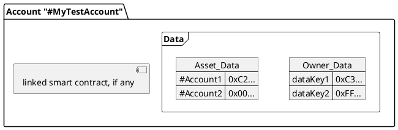

```plantuml
@startuml
allowmixing
package "Account <U+0022><U+0023>MyTestAccount<U+0022>" {
   component "linked smart contract, if any"
   frame Data {
         json Owner_Data {
         "dataKey1":"0xC3...",
         "dataKey2":"0xFF..."
      }
      json Asset_Data {
         "<U+0023>Account1":"0xC2...",
         "<U+0023>Account2":"0x00..."
      }
   }
}
@enduml
```
