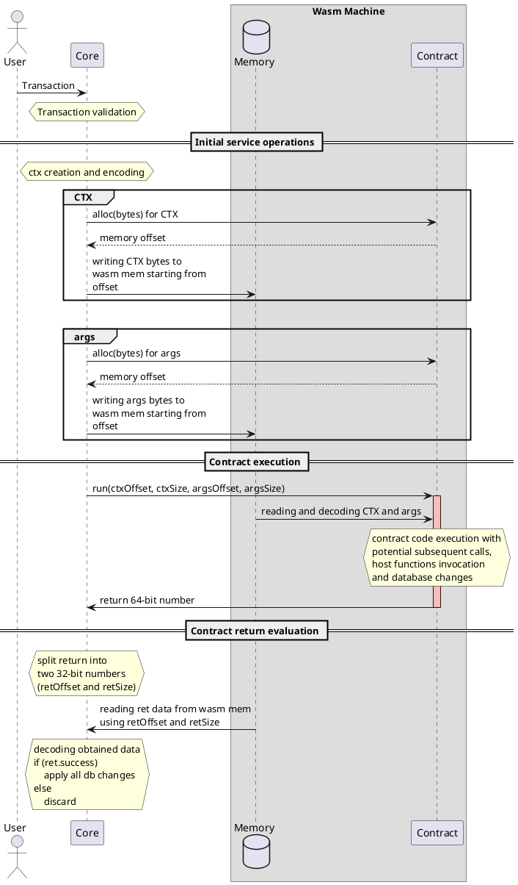

```plantuml
@startuml

actor       User       as user
participant Core       as core
box Wasm Machine
database    "Memory" as mem
participant "Contract"       as wasm
end box
user -> core : Transaction
hnote over core
Transaction validation
endhnote
== Initial service operations ==
hnote over core
ctx creation and encoding
endhnote
group CTX
core -> wasm : alloc(bytes) for CTX
wasm --> core : memory offset
core -> mem  : writing CTX bytes to\nwasm mem starting from\noffset
end
|||
group args
core -> wasm : alloc(bytes) for args
wasm --> core : memory offset
core -> mem  : writing args bytes to\nwasm mem starting from\noffset
end
== Contract execution ==
core -> wasm : run(ctxOffset, ctxSize, argsOffset, argsSize)
activate wasm #FFBBBB
mem -> wasm  : reading and decoding CTX and args
hnote over wasm
contract code execution with
potential subsequent calls,
host functions invocation
and database changes
endhnote
wasm -> core : return 64-bit number
== Contract return evaluation ==
deactivate wasm
hnote over core
split return into
two 32-bit numbers
(retOffset and retSize)
endhnote
mem -> core  : reading ret data from wasm mem\nusing retOffset and retSize
hnote over core
decoding obtained data
if (ret.success)
    apply all db changes
else
    discard
endhnote
@enduml
```