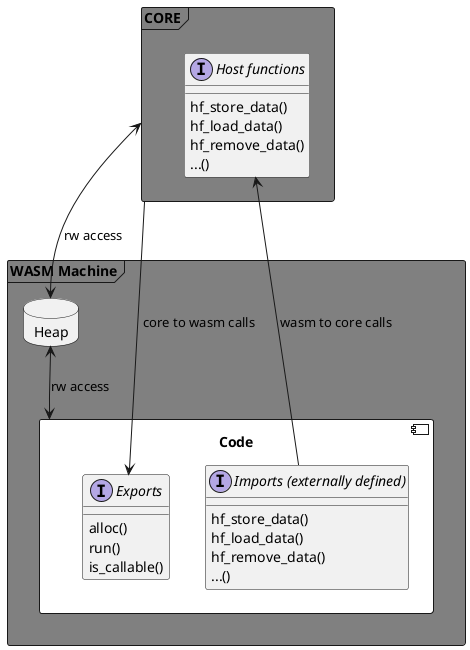

```plantuml
@startuml
allowmixing
frame "WASM Machine" as wasm #gray {
   database "Heap" as wasm_heap
   component "Code" as wasm_code #white {
      interface "Exports" as wasm_exp
      wasm_exp : alloc()
      wasm_exp : run()
      wasm_exp : is_callable()
      interface "Imports (externally defined)" as wasm_imp
      wasm_imp : hf_store_data()
      wasm_imp : hf_load_data()
      wasm_imp : hf_remove_data()
      wasm_imp : ...()
   }
}
frame CORE as core #gray {
   interface "Host functions" as hf
   hf : hf_store_data()
   hf : hf_load_data()
   hf : hf_remove_data()
   hf : ...()
}
core <--> wasm_heap : rw access
core --> wasm_exp : core to wasm calls
wasm_heap <--> wasm_code : rw access
hf <-- wasm_imp : wasm to core calls
@enduml
```
