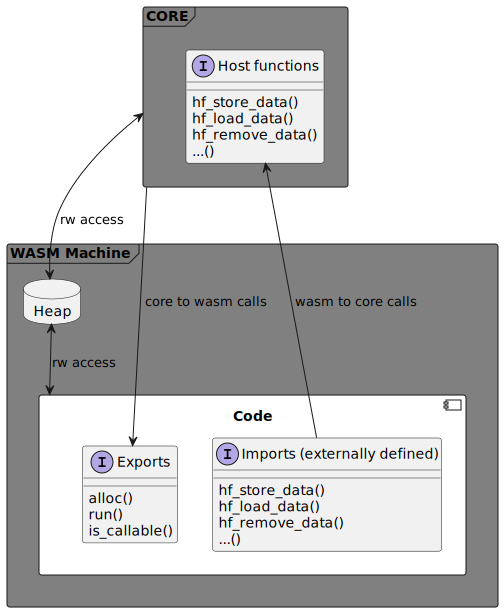
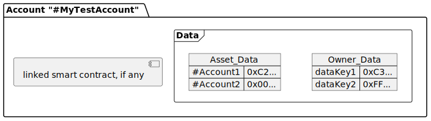
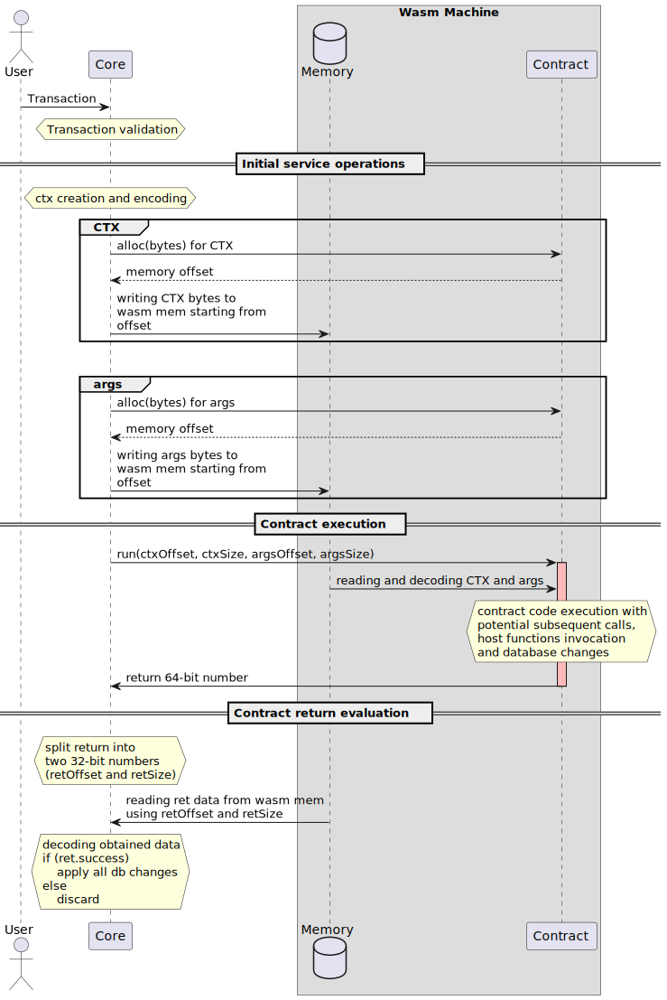

[<BACK](index.md)
# Basic concepts

Below are some basic concepts which apply to every smart contract on TRINCI platform independently of programming languages those contracts are written in.

---

- [Combined pointer](#combined-pointer)

&nbsp;
- [Exports](#exports)
   - [`alloc()`](#allocsize-u32-u32)
   - [`run()`](#runctxaddress-u32-ctxsize-u32-argsaddress-u32-argssize-u32-u64)
   - [`is_callable()`](#is_callablemethodnameaddress-u32-methodnamesize-u32-u8)  
&nbsp;
- [Imports (host functions)](#imports)  
&nbsp;
- [Data structures](#data-structures)
   - [CTX](#ctx)
   - [Return](#return)  
&nbsp;
- [Account data](#account-data)
   - [Owner data](#owner-data)
   - [Asset data](#asset-data)  
&nbsp;
- [Transaction lifecycle](#transaction-lifecycle)
---

## WASM environment overview



&nbsp;

When a TRINCI node receives a transaction an isolated, sandboxed virtual WASM machine running required smart contract code is created.

In order for smart contract to do anything useful it nust have following capabilities:
- Receive data to process from core (transaction method and args)
- Database read/write access (e.g. change balance of an account)
- Return execution result back to the TRINCI core.

In order to achieve required functionality each WASM instance must have following features:
- `Exports` - WASM must provide a number of functions in order for the core to ask WASM for heap allocation and methods execution
- `Imports` - TRINCI core must import into WASM instance a number of functions in order for the smart contract to request data from 'outside'.
- `Heap` - WASM memory heap must be accessible in R/W mode from both core and WASM itself. This is required because the only type that can be passed/returned to/from a WASM function is a number. In order to exchange more complex data structures such structures must be serialized and allocated into memory. Then memory offset and size of data can be passed to/from WASm as numbers.
- `Data serialization format` - WASM smart contracts can be compiled from many different languages. This means a platform- and language-independent serialization method is needed to exchange data structures between different smart contracts and TRINCI core. In case of transaction arguments and results, no controls are performed and data are passed as raw byte arrays. This means that technically any serialization method can be used. However for internal service data exchange (e.g. CTX and HostFunctions) MessagePack was chosen and it is de facto standard for almost all smart contracts on TRINCI platform.

&nbsp;

---
[^UP](#basic-concepts)
## Combined pointer

The only types that can be directly passed to and received from a called WASM functions are numeric types. While number of arguments passed to functions is virtually unlimited, only one number can be returned.

Because of this in cases where it is necessary to return something more complex the return type gets serialized and stored in WASM heap. Then two 32-bit values (memory offset and size in bytes) get combined into a single 64-bit value (hence the name `combined pointer`). Such value gets returned to the core, which splits value back into two 32-bit numbers, loads data from memory, decodes it and gets the actual data returned by function.

&nbsp;

---
[^UP](#basic-concepts)
## Exports

In order for a smart contract to work properly a number of functions must be exported from entry file (usually `assembly/index.ts`):
- #### `alloc(size: u32): u32`
   **REQUIRED**  
   Gets called both by core and internally before writing anything to WASM heap. It allows to use internal wasm memory allocator to safely allocate a contiguous region of WASM heap of `<size>` bytes to store there data to pass to the smart contract. It accepts a 32-bit integer number representing size of data to allocate in bytes and returns memory offset at which to start writing data.

- #### `run(ctxAddress: u32, ctxSize: u32, argsAddress: u32, argsSize: u32): u64`
   **REQUIRED**  
   This is like main() function in many programming languages: it is an entry point that gets called by core and, depending on the internal smart contract logic, calls other internal methods. `run()` gets passed MessagePack encoded CTX (execution context, more on that later) and raw unchanged transaction argument bytes. It returns a 64-bit number, which is two 32-bit numbers representing offset and size of MessagePack encoded return structure (more on that later).
- #### `is_callable(methodNameAddress: u32, methodNameSize: u32): u8`
   **HIGHLY SUGGESTED**  
   This function gets memory offset and size of the MessagePack encoded string containing name of the method. It returns 1 if such method can be called on this smart contract, 0 otherwise. Even if, technically, a smart contract can be executed perfectly fine even without this function exported, it is highly suggested to export such function in order to give core (and other smart contracts) a way to determine if a method can be called on your contract without actually trying to call it.

> Functions described above are already implemented in boilerplate code, which can be found in `boilerplate` directory of the installed `@affidaty/trinci-sdk-as`.  
> See `Initial project setup` section for more.

&nbsp;

---
[^UP](#basic-concepts)
## Imports

These functions are implemented by the host (TRINCI core in our case) and declared as external functions inside smart contract code (`<package_install_dir>/@affidaty/trinci-sdk-as/sdk/env.ts`).
More in dedicated [Host functions](host_functions.md) section

&nbsp;

---
[^UP](#basic-concepts)
## Data structures

Following are data structures passed to/expected by the core in order to communicate with the smart contract.  
> All special data structures used in WASM<->core communications are serialized using MessagePack format. For more info and serialization examples see [MessagePack](messagepack.md) section of the wiki.

### CTX

This structure is passed to the exported `run()` function (first two arguments) along with method arguments and contains information about current smart contract execution context. It's a mixed type array with a fixed length of 6 elements and is structured as follows:

| Elem index | Type | Name | Description |
|------------|------|------|-------------|
| 0 | u16 | Depth | Initial value is `0`, which means that this smart contract execution was initiated directly by a transaction. Depth gets increased automatically by the core each time a sub call occurs (see [`call()`](./host_functions.md#calltargetid-string-method-string-data-u8-typesappoutput) and [`scall()`](./host_functions.md#scalltargetid-string-method-string-contracthash-u8-data-u8-typesappoutput) host functions). |
| 1 | string | Network | Transaction target network name. |
| 2 | string | Owner | This value represents the account id on which current smart contract execution takes place. (For depth=0 it's the target account of the transaction) |
| 3 | string | Caller | Account which initiated the current smart contract execution. On every sub call the current `owner` becomes next caller and the depth is increased by 1. When `depth` is `0` this value is same as `origin`. |
| 4 | string | Method | Smart contract `method` name being currently called by the caller. |
| 5 | string | Origin | Signer of the original transaction which initiated the first smart contract execution (when `depth` was `0`) |

Let's say a client submits a transaction built as follows:
```
target  : "#Target1",
network : "NetworkId",
contract: null,
method  : "my_method",
args    : <Bytes>,
signer  : "#UserAcc"
```

then whatever contract is bound to '#Target1' account (if none, tx fails) will be executed with following CTX:
```json
[
   0,           // depth (initial)
   "NetworkId", // network
   "#Target1",  // owner (tx target)
   "#UserAcc",  // caller (tx signer)
   "my_method", // method (tx method)
   "#UserAcc"   // origin (tx signer)
]
```

If that smart contract makes a subcall with following settings:
```
target: "#Target2",
method: "sub_method",
args  : <Bytes>,
```

Then a smart contract is called on account "#Target2" with following CTX:
```json
[
   1,                // depth (prev + 1)
   "NetworkId",      // network
   "#Target2",       // owner (subcall target)
   "#Target1",       // caller (prev target)
   "sub_method",     // method (subcall method)
   "#UserAcc"        // origin (original tx signer)
]
```

&nbsp;

### Return

Structure returned (not directly, see [Combined pointer](#combined-pointer) section) by exported [`run()`](#runctxaddress-u32-ctxsize-u32-argsaddress-u32-argssize-u32-u64) function after transaction has been processed. It's a mixed type array with a fixed length of 2 elements and is structured as follows:

| Elem index | Type | Name | Description |
|------------|------|------|-------------|
| 0 | bool | success | If `true`, core assumes that transaction as successful and every change made to database over the course of that transaction execution (including eventual sub calls) are to be kept. Otherwise those changes get discarded and database returns to the state immediately preceding that transaction execution. **NOTE:** If during transaction execution sub calls are made, only the original transaction (`depth=0`) return is considered significant by the core. Results of all sub calls must be processed according to the caller smart contract logic and do not influence core's decision on whether to discard changes or keep them. |
| 1 | byte array | result | Result of the transaction. Arbitrary byte array which doesn't get checked by the core. In the case of a failed transaction this field must be set to plain utf-8 encoded error message string. |

&nbsp;

---
[^UP](#basic-concepts)
## Account data

Every TRINCI account is functionally an isolated container for permanent smart contract data storage with [CRUD](https://en.wikipedia.org/wiki/Create,_read,_update_and_delete "Create, Read, Update and Delete") functionality.

All data of an account is seen by TRINCI node as raw byte arrays. This way a better compatibility is achieved, but the major drawback is that every smart contract can have it's own serialization/data handling logic and a client reading an account's data must know how to interpret such data.

Each TRINCI account has two separate containers for data storage:



&nbsp;

### Owner data

This region of account is accessible exclusively to account's own smart contract. It's a key-value storage where a piece of data can be stored and read under a custom key.

In the example above the smart contract linked to `#MyTestAccount`
has stored two pieces of data in it's own database under keys `dataKey1` and `dataKey2`. Those data can be accessed, modified and removed by account's smart contract at any time.

Owner data are managed using following host functions:
- [storeData()](./host_functions.md#storedatakey-string-data-u8-void)
- [storeDataT()](./host_functions.md#storedatattkey-string-object-t-void)
- [loadData()](./host_functions.md#loaddatakey-string-u8)
- [loadDataT()](./host_functions.md#loaddatattkey-string-t)
- [removeData()](./host_functions.md#removedatakey-string-void)
- [getKeys()](./host_functions.md#getkeyspattern-string---string)

### Asset data
This region of account is meant to be used by other accounts to store data. This region is further divided by account which stored data.

> Every smart contract can only access/modify the asset data it stored.

In the diagram above account `#MyTestAccount` has data stored by smart contracts executed on other two accounts: `#Account1` and `#Account2`. Only smart contracts running on those two accounts can access and modify their respective asset data on `#MyTestAccount`.

Asset data are managed using following host functions:
- [storeAsset()](./host_functions.md#storeassetaccountid-string-value-u8-void)
- [storeAssetT()](./host_functions.md#storeassetttaccountid-string-object-t-void)
- [loadAsset()](./host_functions.md#loadassetaccountid-string-u8)
- [loadAssetT()](./host_functions.md#loadassetttaccountid-string-t)
- [removeAsset()](./host_functions.md#removeassetaccountid-string-void)

---
[^UP](#basic-concepts)
## Transaction lifecycle


